# DS2024_facial_expression

Data Science Project for Erdos Institution (Fall 2024)

**Team members:** Yuting Ma, Rui Shi, Menglei Wang, Jiayi Wang

**Keywords:** Facial Expression | Data Augmentation | Feature Extraction | Image Filters | Eigenfaces (PCA) | KNN | Regression | SVM | Random Forest | XGBoost | CNN | FNN | Cross Validation

---

## 📜 Table of Contents

-   [Project Overview](#-project-overview)
-   [Repository Structure](#-repository-structure)
-   [Methodology](#-methodology)
    -   [Data Preprocessing and Augmentation](#data-preprocessing-and-augmentation)
    -   [Feature Extraction Techniques](#feature-extraction-techniques)
    -   [Modeling Approaches](#modeling-approaches)
    -   [Evaluation Metrics](#evaluation-metrics-for-the-testing-images)
-   [Results and Discussion](#-results-and-discussion)
    -   [Feature-Based Models Performance](#feature-based-models-performance-highlights)
    -   [Deep Learning Models Performance](#deep-learning-models-performance)
    -   [Efficiency Trade-offs](#efficiency-trade-offs)
-   [Future Work](#-future-work)
-   [Concluding Remarks](#-concluding-remarks)

---

## 🌟 Project Overview

### Motivation
Facial expressions are a universal form of non-verbal communication. Recognizing these expressions can enhance human-computer interaction, improve accessibility technologies, and enable impactful applications such as mental health monitoring and customer sentiment analysis. Despite advances in the field, creating an accurate and computationally efficient Facial Emotion Recognition (FER) system remains challenging due to imbalanced datasets, face position on the image, real-world variability, and resource constraints.

### Dataset
The project leverages the **FER-2013 dataset**, consisting of 48x48 pixel grayscale facial images across seven emotion categories: anger, disgust, fear, happiness, sadness, surprise, and neutral. This dataset, sourced from Kaggle, consists of 28,709 training images and 7,178 testing images. The original images are stored in the `raw_data` folder.

  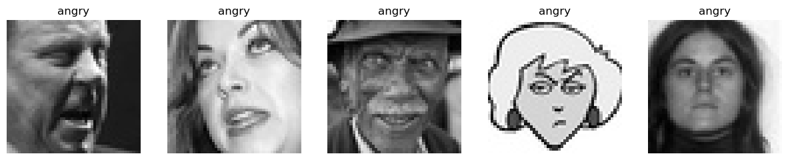
  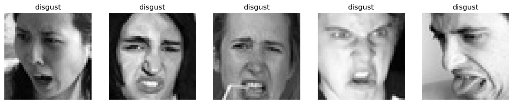

### Goal
To develop a comprehensive FER system consisting of traditional machine learning and deep learning approaches, producing well-tuned models for real-world application.

### Key Performance Indicators (KPIs)
The primary performance metrics include **Accuracy**, **F1-score**, and analysis of the **Confusion Matrix**.

### Related Work
The FER-2013 dataset has inspired numerous studies. Notable baselines include feature-based simple classifiers (e.g., logistic regression). Our project aims to expand on this by integrating advanced data preprocessing, augmentation, feature extraction, ensemble techniques, and Neural Networks.

---

## 📁 Repository Structure

The repository is organized into the following directories:

-   **`Data_Preprocessing`**: Contains notebooks for data importation, augmentation, and Histogram of Oriented Gradients (HOG) feature extraction.
-   **`CNN`**: Includes Jupyter notebooks for the Convolutional Neural Network (CNN) models built with PyTorch and Tensorflow.
-   **`eigenface`**: Contains scripts and notebooks for implementing Eigenfaces (PCA) for feature extraction and classification models like K-Nearest Neighbors (KNN), Logistic Regression, Random Forest, and XGBoost.
-   **`Gabor Filter`**: Includes notebooks for using Gabor filters combined with HOG for feature extraction and an XGBoost classifier.
-   **`MediaPipe`**: Contains notebooks that leverage the MediaPipe library for facial landmark detection, combined with Gabor filters and various classifiers (Random Forest, XGBoost, KNN).
-   **`images_for_readme`**: Stores images and visual aids used in this README file.

---

## 🛠️ Methodology

### Data Preprocessing and Augmentation

1.  **Standardization**: Images are resized to 48x48 pixels and denoised to improve quality. The initial conversion of images to grayscale numerical data is available in the `raw_data_to_csv` folder.
2.  **Data Augmentation**: To address class imbalance, minority classes are augmented using transformation techniques such as rotation, flipping, and zooming. Some majority classes are downsampled. The resulting balanced dataset is found in the `train_balanced` folder.

### Feature Extraction Techniques

We explore multiple feature extraction techniques. Implementations and specific models related to MediaPipe, Gabor Filter, and Eigenface methods can be found in their respective folders: `MediaPipe`, `Gabor Filter`, and `eigenface`.

1.  **Histogram of Oriented Gradients (HOG):**
    * Extracts gradient-based features to emphasize edges and textures.
    * **Parameters:**
        * Cell size: 4-16
        * Block size: 2-4
        * Number of orientation bins: 4-10
    * **Output:** Gradient histograms focusing on local intensity changes.
    

      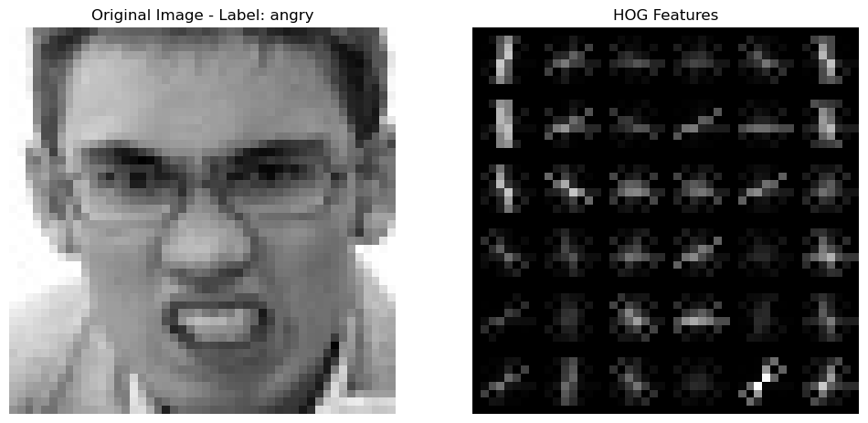
    

2.  **Local Binary Patterns (LBP):**
    * Captures texture patterns using uniform LBP configurations.
    * **Parameters:**
        * Radius: 1–3 pixels.
        * Neighbors: 8–24 points.
    * **Output:** Histograms representing frequency distributions of patterns. Often binary for simplicity with the uniform method.
    

      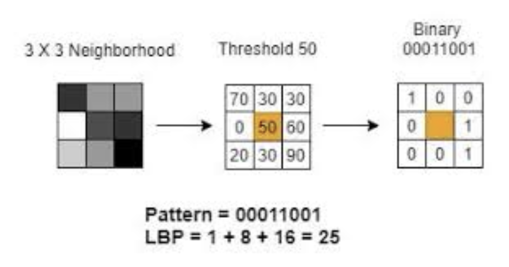
    

3.  **MediaPipe Facial Landmarks:**
    * Extracts 478 3D facial landmark points (x, y, z coordinates) per image.
    * **Output:** Landmark-based geometric features representing facial structure. (Associated scripts in `MediaPipe` folder)
    

      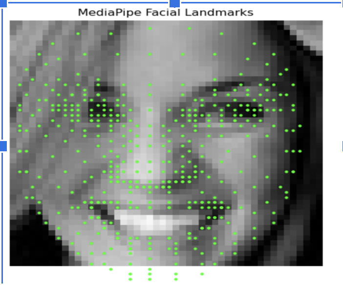
    

4.  **Gabor Filter:**
    * Extracts texture features by identifying specific frequencies and orientations. (Associated scripts in `Gabor Filter` folder)
    * **Parameters:** Wavelength ($\lambda$), Orientation ($\theta$), Phase offset ($\phi$), Aspect ratio ($\gamma$), Bandwidth ($\sigma$)
    * **Output:** Response map highlighting edges and textures.
    

      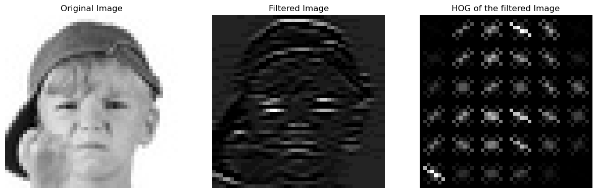
    

5.  **Eigenface Analysis (PCA):**
    * A dimensionality reduction technique based on Principal Component Analysis (PCA). (Associated scripts in `eigenface` folder)
    * **Implementation Steps:**
        * Extract Principal Components: Decompose normalized face images into orthogonal eigenvectors (i.e., eigenfaces).
        * Variance Retention: Retain eigenvectors explaining 90% of the variance.
        * Projection onto Eigenvectors: Map input data onto the Eigenspace.
    * **Output:** Compressed, variance-maximized feature vectors.
    

      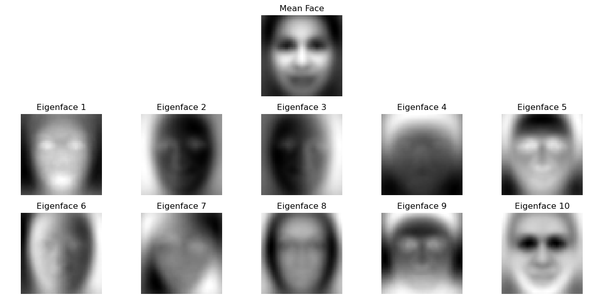
    

### Modeling Approaches

1.  **Feature-Based Approaches:**
    * Employs traditional classifiers such as K-Nearest Neighbors (KNN), Support Vector Machines (SVM), Random Forest, and Logistic Regression.
    * Ensemble methods like XGBoost are used for enhanced performance.

2.  **Deep Learning Approaches:**
    * **Custom CNN:** Design and train Convolutional Neural Networks (CNN) tailored to the FER-2013 dataset.
        * **Training Techniques:**
            * Loss: Categorical cross-entropy.
            * Optimizer: Adam with dynamic learning rate scheduling.
            * Data Augmentation: Transformations applied dynamically during training.
            * Regularization: Early stopping and dropout to reduce overfitting.
    * **Transfer Learning (ResNet50):** Leverages a pre-trained ResNet50 model, fine-tuned for emotion classification.

### Evaluation Metrics for the testing images

* **Quantitative Metrics:** Accuracy, precision, recall, F1-score, ROC-AUC.
* **Efficiency Metrics:** Inference time, model size, and resource usage.
* **Confusion Matrix Analysis:** Identify and address misclassifications across different classes.

---

## 📊 Results and Discussion

### Feature-Based Models Performance Highlights

**Overall Accuracy and Weighted F1 Scores:**

* PCA + Logistic Regression (baseline): Accuracy 37%, F1-score 0.35.
* PCA + KNN: Best at k=1, Accuracy 40%, F1-score 0.40.
* PCA + Random Forest: Accuracy 45%, F1-score 0.41 (after grid search & CV).
* PCA + XGBoost: Accuracy 48%, F1-score 0.46 (after grid search & CV).
* LBP + KNN: Accuracy 29.38%, F1-score 0.30.
* LBP + SVM: Accuracy 33.73%, F1-score 0.30.
* LBP + Random Forest: Accuracy 37.21%, F1-score 0.34.
* LBP + XGBoost: Accuracy 35.68%, F1-score 0.33.
* MediaPipe + PCA + KNN: Accuracy 34%, F1-score 0.34.
* MediaPipe + PCA + Random Forest: Accuracy 52%, F1-score 0.50.
* MediaPipe & PCA + Gabor Filter & PCA + Random Forest: Accuracy 49%, F1-score 0.48.
* HOG & PCA + Gabor Filter & PCA + XGBoost: Accuracy 54%, F1-score 0.53 (after grid search & CV). This highlights the potential of combining gradient-based (HOG) and texture-rich (Gabor) features with ensemble learning.
* **Gabor Filter & PCA + MediaPipe & PCA + XGBoost: Best feature-based performance with Accuracy 60%, F1-score 0.59.** This demonstrates the effectiveness of integrating geometric facial landmarks (MediaPipe) with Gabor-based texture features.

**Selected Confusion Matrices of Some Classifiers:**

  <em>MediaPipe & PCA + Gabor Filter & PCA + RandomForest</em> 
  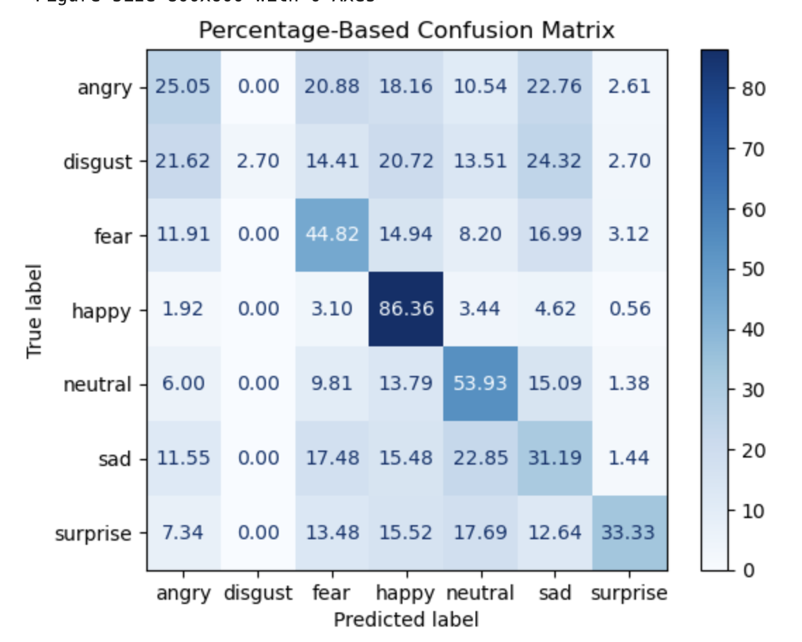

  <em>MediaPipe & PCA + Gabor Filter & PCA + XGBoost</em> 
  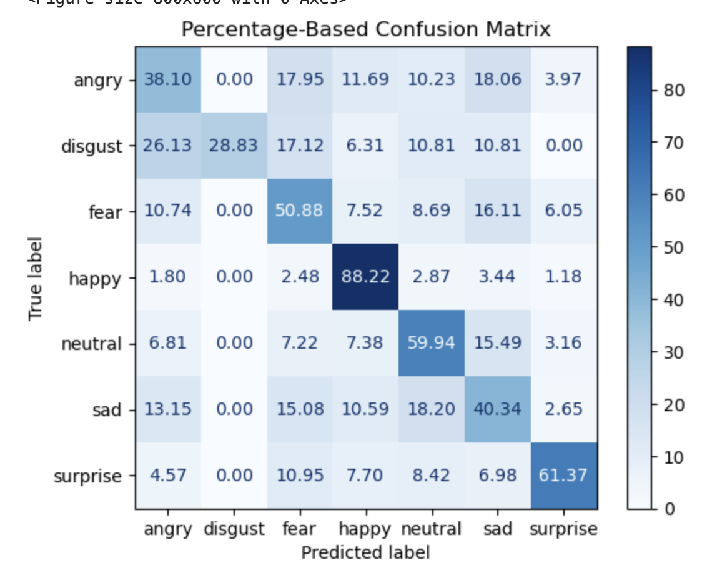

  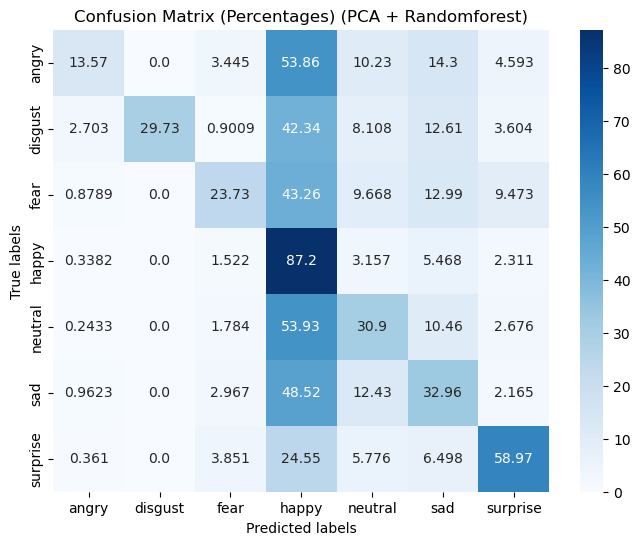
  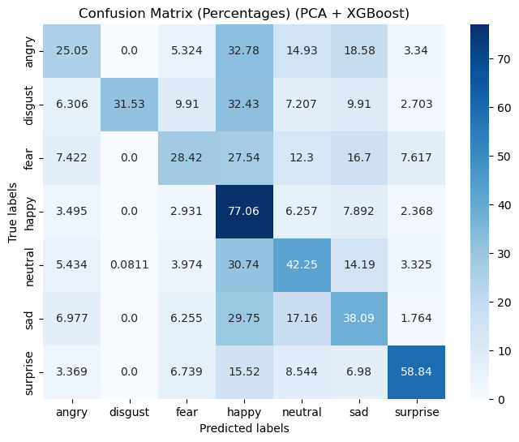
  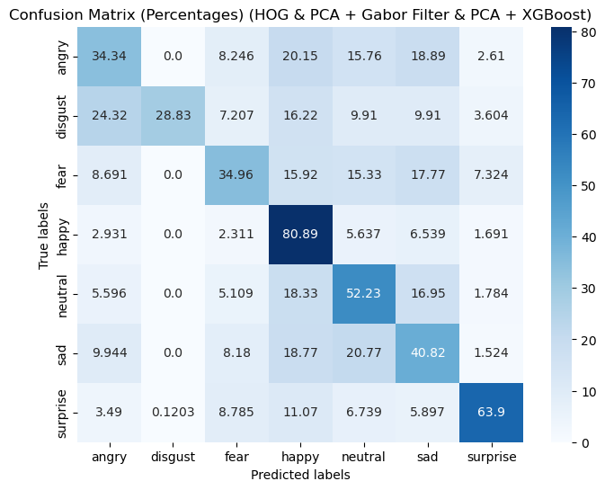

### Deep Learning Models Performance

**Custom CNN:**
Achieved a test accuracy of **63.39%** with a test loss of 1.038.
* Kernel size: (3,3)
* Number of filters: (32, 64, 128)
* Learning rate: 0.0005
* Epochs: 60

  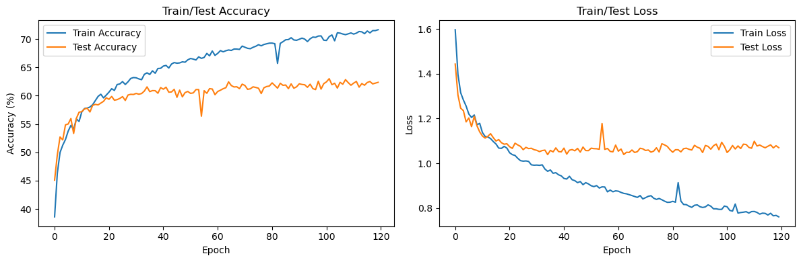

**Transfer Learning Approach (ResNet50):**
This approach leverages the 50-layer deep ResNet50, pre-trained on ImageNet. The model was fine-tuned on FER-2013 by replacing the final classification layer.
* Achieved over **65% accuracy**, surpassing some Kaggle benchmarks for neural networks on the FER2013 dataset.

  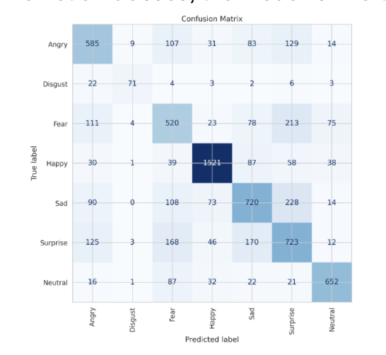

### Efficiency Trade-offs

* **Feature-Based Methods:** Offered higher computational efficiency but were generally constrained by lower accuracy.
* **Deep Learning Models:** Provided superior accuracy at the expense of greater computational resources, making hardware optimization a key consideration for real-world deployment.

---

## 🚀 Future Work

* **Model Generalization:** Train and validate models on additional datasets (e.g., CK+, JAFFE) to improve real-world performance.
* **Edge Device Deployment:** Optimize CNN architectures for mobile and edge deployment using model compression techniques like pruning and quantization.
* **Emotion Grouping:** Test broader emotion categories (e.g., positive vs. negative) to simplify classification and potentially improve accuracy in certain applications.
* **Multi-Modal Integration:** Combine facial features with vocal or physiological data for a more comprehensive emotion recognition system.

---

## ✨ Concluding Remarks

This project successfully explored a diverse range of techniques for facial expression recognition, from classic machine learning pipelines to modern deep learning architectures. Our findings reveal a clear performance advantage for deep learning, with the custom CNN model achieving the highest accuracy. However, feature-based methods, particularly the combination of MediaPipe, Gabor filters, and XGBoost, offer a compelling balance of performance and computational efficiency. This work not only provides a comprehensive comparison of various FER techniques but also lays the groundwork for developing practical, real-world applications in areas such as human-computer interaction and mental health monitoring. The journey through this project underscores the immense potential of both traditional and deep learning approaches in understanding and interpreting human emotions.
